# 🧩 Actividad 2.3 — Despliegue del sitio con Apache y Nginx usando Docker

## 📘 Descripción del proyecto

En esta práctica se desplegaron dos servidores web — **Apache** y **Nginx** — utilizando contenedores **Docker** y gestionados mediante **Docker Compose**.  
El objetivo fue servir un mismo sitio web estático en ambos servidores, aplicando *bind mounts* para enlazar los archivos locales del proyecto con los directorios internos de los contenedores.

Esta práctica replica las anteriores (2.1 y 2.2), pero usando contenedores en lugar de instalaciones locales.

---

## ⚙️ Pasos seguidos para la instalación y despliegue

### 1️⃣ Preparación del entorno

- Se utilizó una máquina virtual con **Ubuntu Server**.
- Se instalaron Docker y Docker Compose:

  ```bash
  sudo apt update
  sudo apt install docker.io -y
  sudo systemctl enable --now docker
  sudo usermod -aG docker $USER
  sudo apt install docker-compose -y
  ```

  > Tras añadir el usuario al grupo `docker`, fue necesario cerrar sesión y volver a entrar.

- Se creó la siguiente estructura de carpetas:

  ```
  act2_3_despliegue_docker/
  ├── docker-compose.yml
  ├── ejemplo_sitio_apache/
  │   ├── index.html
  │   ├── css/
  │   ├── img/
  │   └── ...
  ├── ejemplo_sitio_nginx/
  │   ├── index.html
  │   ├── css/
  │   ├── img/
  │   └── ...
  └── nginx/
      └── default.conf
  ```

---

### 2️⃣ Configuración de los sitios

#### 🧱 Apache

Se utilizó la imagen oficial `httpd:2.4` y se montó el sitio mediante un *bind mount* hacia `/usr/local/apache2/htdocs`.

#### ⚡ Nginx

Se usó la imagen `nginx:stable-alpine` con un *bind mount* hacia `/usr/share/nginx/html`  
y un bloque de servidor personalizado (`nginx/default.conf`):

```nginx
server {
    listen 80;
    server_name localhost;

    location / {
        root /usr/share/nginx/html;
        index index.html;
    }
}
```

---

### 3️⃣ Archivo `docker-compose.yml`

```yaml
services:
  apache:
    image: httpd:2.4
    container_name: apache-a23
    ports:
      - "8083:80"
    volumes:
      - ./ejemplo_sitio_apache:/usr/local/apache2/htdocs:ro
    restart: unless-stopped
    healthcheck:
      test: ["CMD-SHELL", "httpd -t || exit 1"]
      interval: 30s
      timeout: 3s
      retries: 3
      start_period: 5s

  nginx:
    image: nginx:stable-alpine
    container_name: nginx-a24
    ports:
      - "8084:80"
    volumes:
      - ./ejemplo_sitio_nginx:/usr/share/nginx/html:ro
      - ./nginx/default.conf:/etc/nginx/conf.d/default.conf:ro
    restart: unless-stopped
    healthcheck:
      test: ["CMD-SHELL", "nginx -t || exit 1"]
      interval: 30s
      timeout: 3s
      retries: 3
      start_period: 5s
```

---

### 4️⃣ Despliegue con Docker Compose

Antes de levantar los contenedores, se eliminaron los anteriores (por si existían):

```bash
docker stop apache-a23 nginx-a24
docker rm apache-a23 nginx-a24
```

Luego, se ejecutó:

```bash
docker-compose up -d
```

Verificación del estado de los contenedores:

```bash
docker ps
```

---

### 5️⃣ Comprobaciones de funcionamiento

#### 🔎 Desde el navegador (host):
- Apache: [http://localhost:8083](http://localhost:8083)
- Nginx: [http://localhost:8084](http://localhost:8084)


---

## 🖼️ Capturas de pantalla

### Instalacion Docker
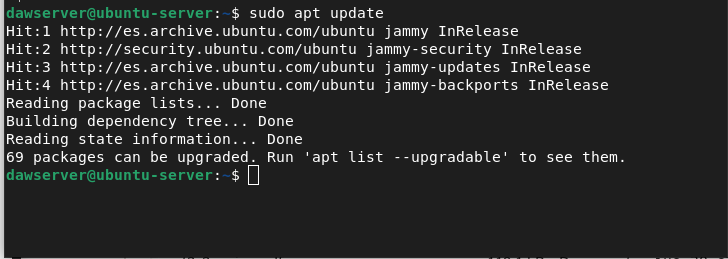

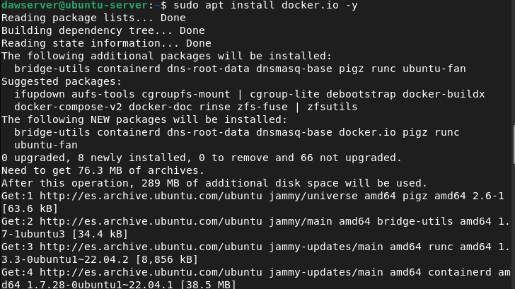
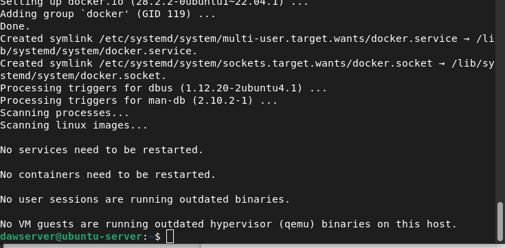

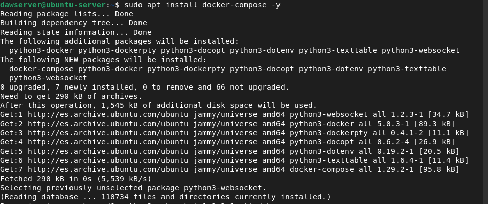
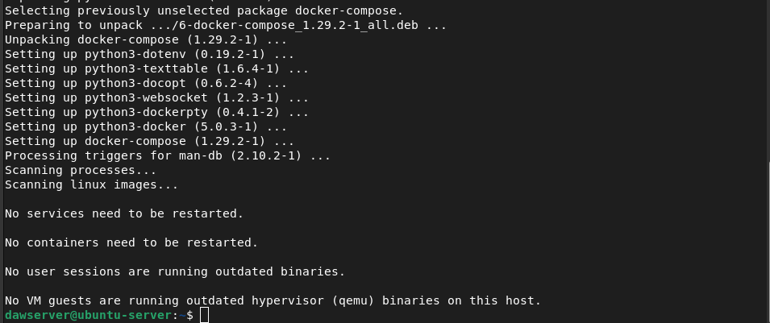

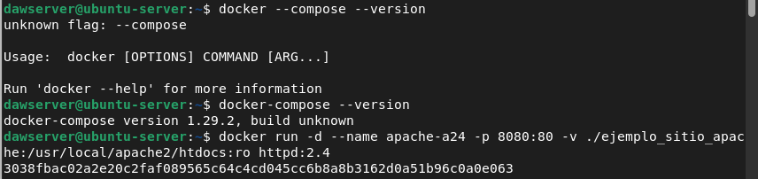

### Levantamiento Apache y Nginx
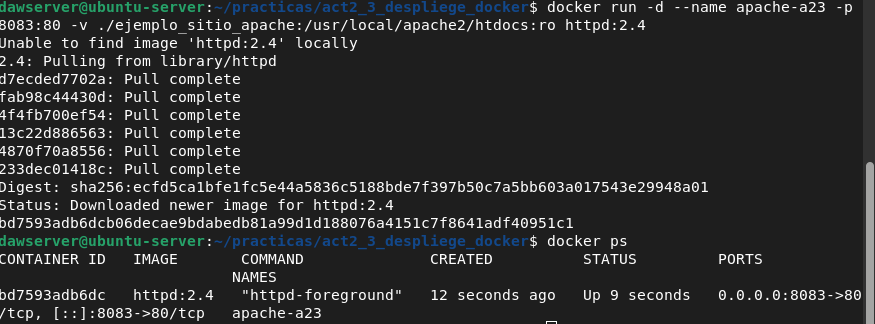

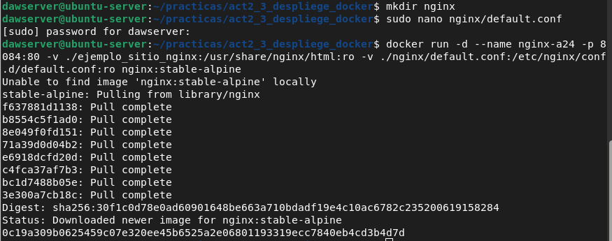


### Verificacion sitios Apache y Nginx
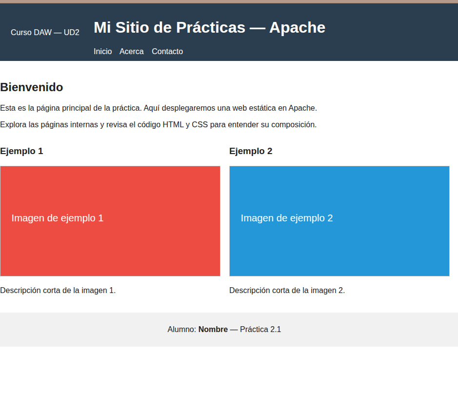

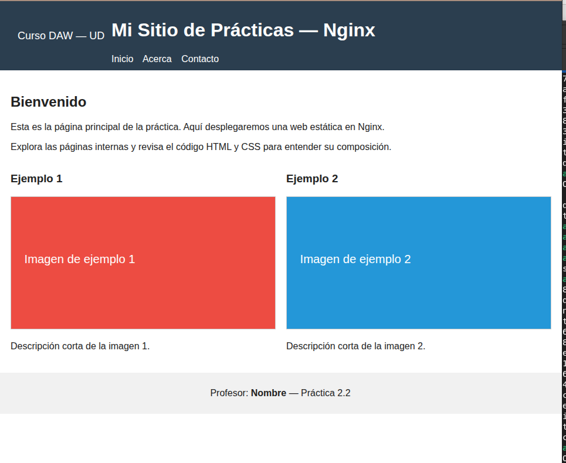


### Levantamiento Contenedores
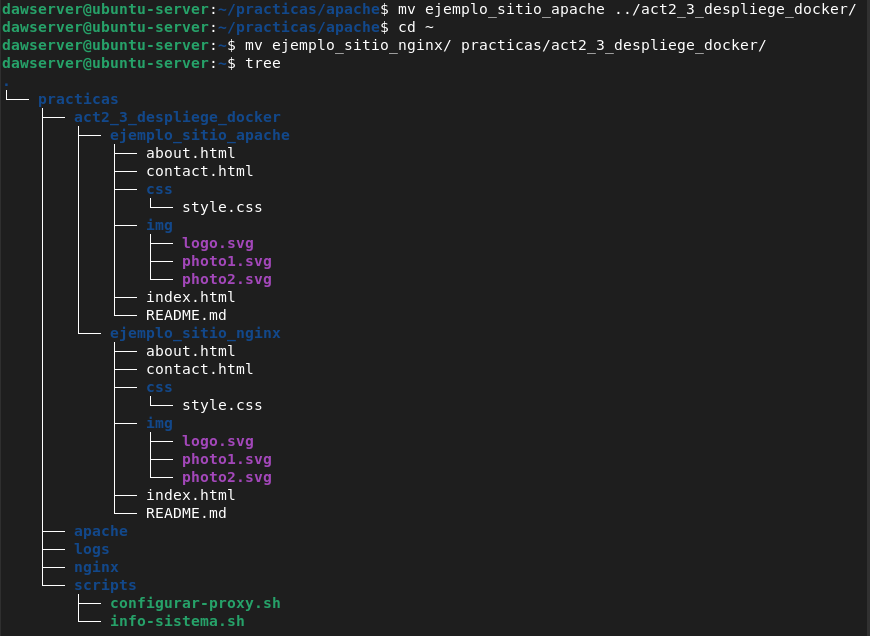

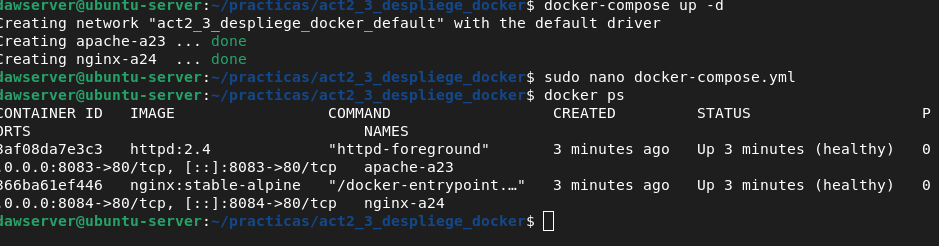


---

## ⚠️ Problemas encontrados y soluciones

| Problema | Causa | Solución |
|-----------|--------|-----------|
| Error `KeyError: 'ContainerConfig'` al ejecutar `docker-compose up` | Bug en Docker Compose 1.29 al recrear contenedores con volúmenes de solo lectura (`:ro`) | Ejecuté `docker-compose down -v` y corregí las rutas en `volumes:` (usando `./ejemplo_sitio_nginx` en lugar de `./practicas/...`) |
| Nginx no arrancaba correctamente | El archivo `default.conf` no se montaba en la ruta esperada | Verifiqué el *bind mount* y usé la ruta relativa `./nginx/default.conf:/etc/nginx/conf.d/default.conf:ro` |

---

## 🧾 Conclusión

Esta práctica permitió desplegar y comparar el funcionamiento de Apache y Nginx dentro de contenedores Docker.  
El despliegue mediante **Docker Compose** facilita la automatización y gestión conjunta de ambos servicios.

---

✉️ **Autor:** *Ivan Gonzalves*  
💻 **Asignatura:** Despliegue de Aplicaciones Web  
🏫 **Curso:** 2º DAW  
📅 **Actividad:** 2.3 — Despliegue con Docker
